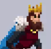
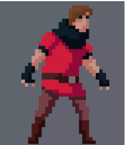
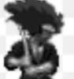
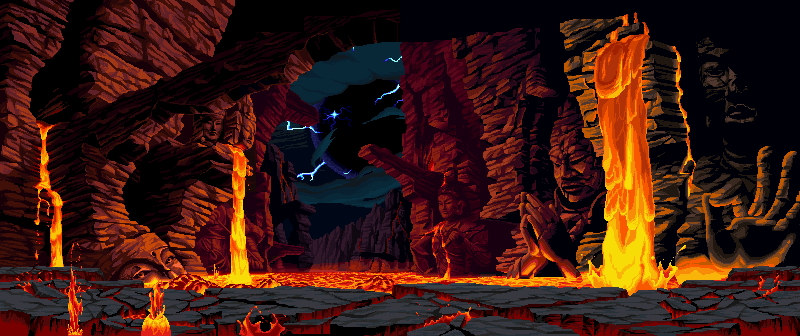
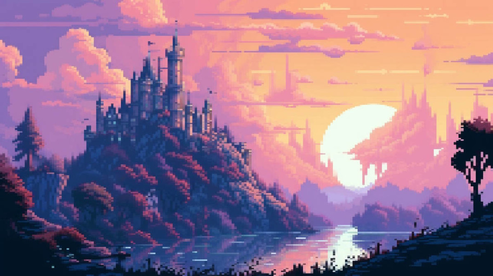
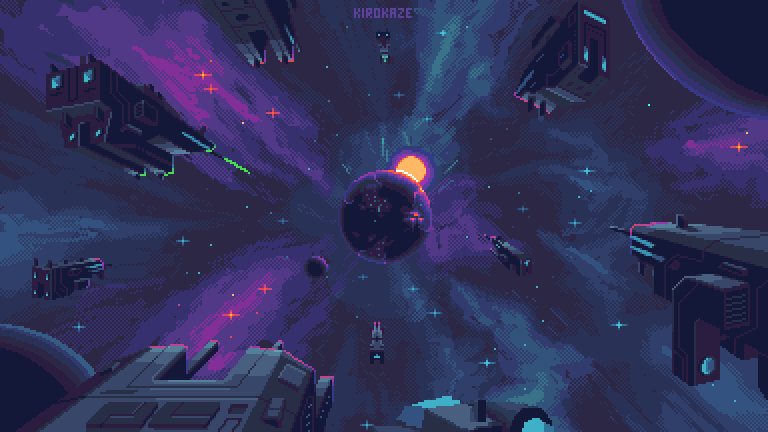
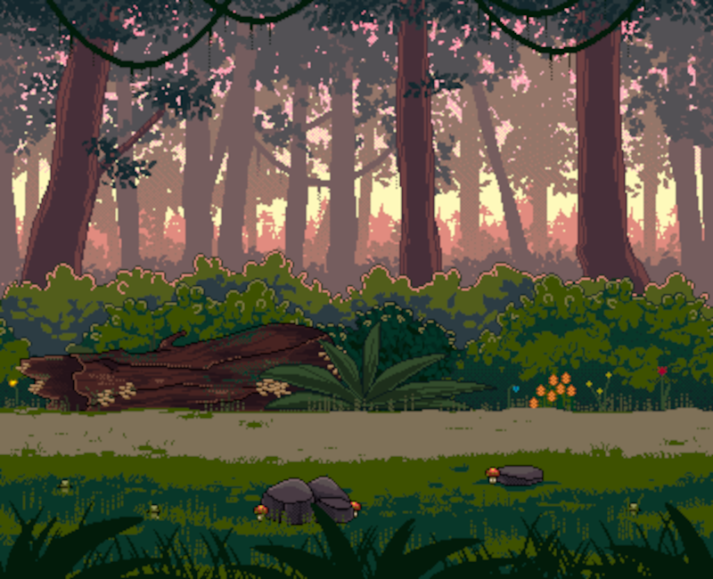
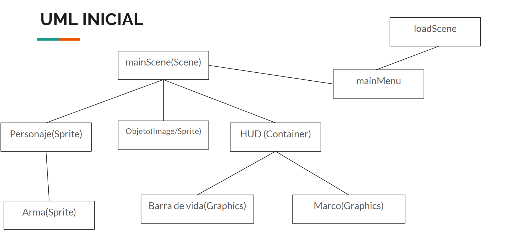

# 
Ego-Battle GDD

## 
Black Hole Studios

Javier Bravo Perucho, David Rubio Moreno, Sergio Pérez Robledano y Álvaro Vergara Fernández

**Género**: Plataformas, JcJ, Pelea\
**Target**: Todos los públicos\
**Plataforma**: PC

## Estética
- PixelArt
* Personalidades opuestas
- Fantasía medieval
- Escenarios extraordinarios de la naturaleza

## Mecánicas
### Jugador

- Ataque principal(0,5s-1s), tecla G y 5: causa daño y no deja atacar al que golpea(0.4s) y le baja la movilidad(0.4s);

- Ataque secundario(0.35s-1s), tecla H y 6: empuja y causa menos daño(no ralentiza)

- Se genera la hitbox de daño/empuje 0.1s antes de que acabe la animación para poder esquivar.

- Movimiento wad y flechas del teclado numérico(W es para saltar(doble salto))

- Si te pegan mientras atacas se cancela el ataque.

- Durante cada partida, cada personaje tiene 3 vidas. Al morir (acabarse la barra de vida o caer al vacío) un personaje pierde una vida, y si pierde las 3 aparece una pantalla final donde se declara al ganador de la partida.

- Cuando pierdes la vida sale la animación de muerte y vuelves a aparecer en un punto de aparición con 3s de invulnerabilidad. Si ataca antes de los 3s se desactiva la invulnerabilidad.

- Cada personaje tiene una barra de poder que se va llenando en función de una mecánica relacionada con su personalidad, y al llenarse al completo los personajes tienen una habilidad (activa o pasiva). Las habilidades activas se realizan con la tecla del ataque.
Si muere no se reinicia la barra.

- Los ataques provocan un empuje contra el oponente, que es mayor cuanta menos vida tenga.

### Escenarios:
 Caen objetos (dependen del mapa elegido) cada cierto tiempo desde arriba hacia la arena, si da a un jugador en el aire le empuja hacia un lado(un poco). Al llegar al suelo genera una onda que empuja a los jugadores y les hace daño. Si un jugador lo golpea en cualquier momento lo lanza en la dirección del golpe, pudiendo causar daño a los jugadores.

Los escenarios tienen una plataforma grande principal donde los personajes pelean y algunas plataformas más pequeñas colocadas estratégicamente. Algunas de las plataformas pequeñas se mueven hacia los lados y otras de arriba abajo.

Si un personaje se cae del mapa muere.

## Dinámica

El objetivo del juego es ganar a tu oponente ganando 3 rondas. Una ronda se gana si el oponente muere, ya sea por perder toda la vida o por caerse al vacío.

Las partidas son relativamente rápidas, se puede decidir si se juega con límite de tiempo por ronda(2:30) o sin límite.

Los jugadores escogen su personaje en función de la personalidad que más les guste y se enfrentan contra su oponente en el mismo teclado. Esto puede crear competitividad y hacer el juego interesante. No se pueden enfrentar dos personajes al mismo tiempo.

## Personajes:
- **Arturo**: Es orgulloso y carismático, se guía por sus sentimientos. Tiene un aspecto heroico con una corona y una capa.\

    - Ataque principal: espadazo imponente(daño alto y alcance medio)\
    - Ataque secundario: espadazo corto y rápido de corto alcance\
    - Barra de poder: mientras no recibe daño carga la barra, ya que mantiene su orgullo y gana confianza.\
    - Poder: Con su voz de líder y manipulador convence al oponente a rendirse ante él y hacerse daño a sí mismo.

- **Azazel**: Es un maestro táctico y juzga muy bien sus acciones.  Tiene un estilo de combate con el que gana a su oponente de forma estratégica.

    - Ataque principal: llamarada que paraliza a los oponentes durante un tiempo y tiene rango suficiente para que la mayoría de ataques de los otros personajes no le lleguen a dañar, pero es un ataque que tarda bastante tiempo y puede castigar bastante si se falla. Por eso el jugador debe pensar bien cuándo usar este ataque estratégicamente para maximizar su valor.\
    - Ataque secundario: lanza una bola de fuego que puede hacerle daño a él también si está demasiado cerca, por lo que debe tener cuidado de dónde la lanza.\
    - Barra de poder: Mientras está quieto llena poder, ya que está pensando un plan y considerando todas las opciones.\
    - Poder: Ha averiguado los puntos débiles del oponente y hace más daño con sus ataques durante un tiempo.

 

- **Trevor**: Es un personaje agresivo y directo. Realiza combate cuerpo a cuerpo y se lanza a sus oponentes con furia, guiándose por sus instintos.

    - Ataque principal: Dash con una lanza hacia delante causando daño(medio)
    - Ataque secundario: golpea con la maza(daño + empuje)
    - Barra de poder: se recarga recibiendo daño
    - Poder: al haber recibido bastante daño su furia se ha acumulado y se vuelve loco, corriendo hacia su oponente como una bestia y realizando muchos ataques en poco tiempo.

 

- **Shinji**: Es introvertido. Por eso no realiza combate cuerpo a cuerpo, solo lanza proyectiles desde lejos.

    - Ataque principal: lanza shurikens(largo alcance(no les afecta la gravedad))\
    - Ataque secundario: lanza bombas pegajosas(corto alcance en forma de parábola(explotan empujando a los rivales(daño si se pegan alto, si no bajo)))\
    - Barra de poder: se rellena mientras más tiempo esté lejos del oponente ya que de esta forma gana confianza y se prepara para un ataque fuerte.\
    - Poder: se teletransporta detrás del rival, realizando un ataque fuerte por la espalda.

  

## Mapas

- **Volcán**: Las plataformas tienen lava y en el fondo hay un volcán. Caen bolas de fuego desde el volcán que explotan al caer al suelo empujando.

 

- **Castillo medieval**: Formado por torres y patios. Caen espadas que aplican sangrado

 

- **Nave espacial**: En medio del espacio, con planetas y alienígenas. Hay un ovni moviéndose de un lado al otro disparando rayos láser.

 

- **Jungla**: Lianas y vegetación alrededor. Caen cocos que rebotan por el mapa

 

- **Muelle**: Diferentes alturas para pelear. Saltan peces del agua y al caer golpean a los jugadores.

 

## UML

 

## UI:

- Barra de vida a cada lado con imagen del personajes\
- La puntuación en el centro. Ejemplo:   2-2\
- Barra de poder, debajo de la barra de vida y más corta\
- No hay botón de pausa para que nadie pare la partida.\
- Indicador de combo de golpes, se reinician si fallas un ataque o si pasa 1s. Ejemplo: x1

## Menú

Botón jugar\
-> Menú de selección de personaje(se cambia de personaje cada uno con sus flechas): Aparecen descripciones de los personajes sobre sus personalidades y atributos.\
-> Menú de selección de mapa(puedes elegir un mapa o dándole a un botón activar el random)\
-> Botón para iniciar la partida.

## Sonido

- Frase al seleccionar a cada personaje
- Frase principal de cada personaje al iniciar la ronda(primero la dice uno y luego el otro) 
- Frase al quitarle una vida al oponente(2 frases(random))
- Frase al ganar la partida.
- Frase al activar el poder.
- Música en cada mapa.
- Sonidos al hacer los ataques.
- Sonido al caer los barriles, al pegarles y al caer al suelo.
- Al seleccionar un personaje en el menú hace un sonido.
- Sonido característico al recibir daño(no si siempre suena)
Diálogos graciosos en momentos random de la partida.

## Juegos similares
- Smash Bros
- Brawlhalla
- Street Fighter
- Mortal Kombat

## Recursos
https://assetstore.unity.com/packages/2d/characters/ninja-sprite-sheet-free-93901#content
https://assetstore.unity.com/packages/2d/characters/medieval-king-pack-2-174863
https://assetstore.unity.com/packages/2d/characters/medieval-warrior-pack-2-174788
https://assetstore.unity.com/packages/2d/characters/evil-wizard-168007
