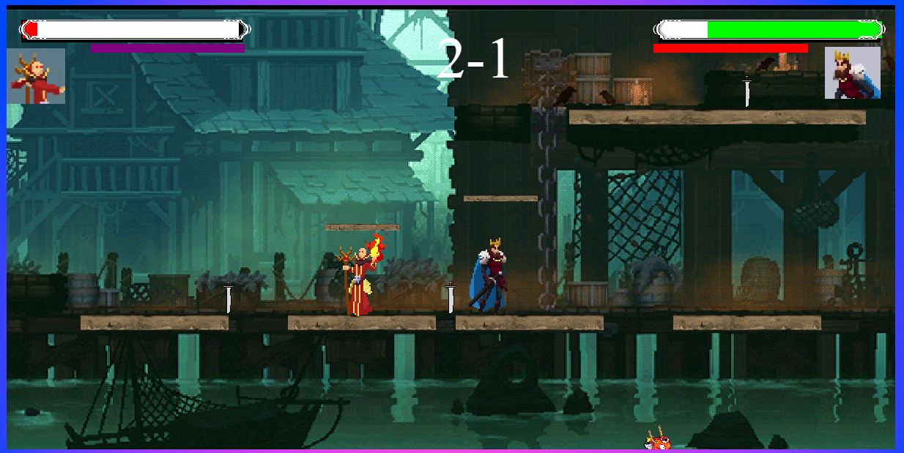

# 
Ego-Battle GDD

## 
Black Hole Studios

Javier Bravo Perucho, David Rubio Moreno, Sergio Pérez Robledano y Álvaro Vergara Fernández

**Género**: Plataformas, JcJ, Pelea\
**Target**: Todos los públicos\
**Plataforma**: PC

## Estética
- PixelArt
* Personalidades opuestas
- Fantasía medieval
- Escenarios extraordinarios de la naturaleza

## Mecánicas
### Jugador

- Ataque principal(0,5s-1s), tecla G y 5: causa daño y no deja atacar al que golpea(0.4s) y le baja la movilidad(0.4s);

- Ataque secundario(0.35s-1s), tecla H y 6: empuja y causa menos daño(no ralentiza)

- Se genera la hitbox de daño/empuje 0.1s antes de que acabe la animación para poder esquivar.

- Movimiento wad y flechas del teclado numérico(W es para saltar(doble salto))

- Si te pegan mientras atacas se cancela el ataque.

- Durante cada partida, cada personaje tiene una barra con 300 de vida. Al morir (acabarse la barra de vida o caer al vacío) un personaje pierde una ronda, y si pierde las 3 aparece una pantalla final donde se declara al ganador de la partida.

- Cuando pierdes la ronda sale la animación de muerte y vuelves a aparecer en un punto de aparición con 3s de invulnerabilidad. Si ataca antes de los 3s se desactiva la invulnerabilidad.

- Cada personaje tiene una barra de poder que se va llenando en función de una mecánica relacionada con su personalidad, y al llenarse al completo los personajes tienen una habilidad (activa o pasiva). Las habilidades activas se realizan con la tecla del ataque.
Si muere no se reinicia la barra.

- Los ataques provocan un empuje contra el oponente, que es mayor cuanta menos vida tenga.

### Escenarios:
 Caen objetos (dependen del mapa elegido) cada cierto tiempo desde arriba hacia la arena, si da a un jugador en el aire le empuja hacia un lado(un poco). Al llegar al suelo genera una onda que empuja a los jugadores y les hace daño(3 de daño). Si un jugador lo golpea en cualquier momento lo lanza en la dirección del golpe, pudiendo causar daño a los jugadores.

Los escenarios tienen una plataforma grande principal donde los personajes pelean y algunas plataformas más pequeñas colocadas estratégicamente. Algunas de las plataformas pequeñas se mueven hacia los lados y otras de arriba abajo.

Si un personaje se cae del mapa muere.

## Dinámica

El objetivo del juego es ganar a tu oponente ganando 3 rondas. Una ronda se gana si el oponente muere, ya sea por perder toda la vida o por caerse al vacío.

Las partidas son relativamente rápidas, se puede decidir si se juega con límite de tiempo por ronda(2:30) o sin límite.

Los jugadores escogen su personaje en función de la personalidad que más les guste y se enfrentan contra su oponente en el mismo teclado. Esto puede crear competitividad y hacer el juego interesante. No se pueden enfrentar dos personajes al mismo tiempo.

## Personajes:
- **Arturo**: Es orgulloso y carismático, se guía por sus sentimientos. Tiene un aspecto heroico con una corona y una capa.\

    - Ataque principal: espadazo imponente(10 de daño y alcance medio)\
    - Ataque secundario: espadazo corto y rápido de corto alcance(5 de daño)\
    - Barra de poder: mientras no recibe daño carga la barra, ya que mantiene su orgullo y gana confianza.\
    - Poder: Con su voz de líder y manipulador convence al oponente a rendirse ante él y hacerse daño a sí mismo(50 de daño).

- **Azazel**: Es un maestro táctico y juzga muy bien sus acciones.  Tiene un estilo de combate con el que gana a su oponente de forma estratégica.

    - Ataque principal: llamarada que paraliza a los oponentes durante un tiempo(2s, 10 de daño) y tiene rango suficiente para que la mayoría de ataques de los otros personajes no le lleguen a dañar, pero es un ataque que tarda bastante tiempo y puede castigar bastante si se falla. Por eso el jugador debe pensar bien cuándo usar este ataque estratégicamente para maximizar su valor.\
    - Ataque secundario: lanza una bola de fuego que puede hacerle daño (10 de daño) a él también si está demasiado cerca, por lo que debe tener cuidado de dónde la lanza.\
    - Barra de poder: Mientras está quieto llena poder, ya que está pensando un plan y considerando todas las opciones.\
    - Poder: Ha averiguado los puntos débiles del oponente y hace más daño con sus ataques durante un tiempo(+10 en cada ataque, durante 10 segundos).

 

- **Trevor**: Es un personaje agresivo y directo. Realiza combate cuerpo a cuerpo y se lanza a sus oponentes con furia, guiándose por sus instintos.

    - Ataque principal: Dash con una lanza hacia delante causando daño(10 de daño)
    - Ataque secundario: golpea con la maza(7 daño + empuje)
    - Barra de poder: se recarga recibiendo daño
    - Poder: al haber recibido bastante daño su furia se ha acumulado y se vuelve loco, corriendo hacia su oponente como una bestia y realizando muchos ataques en poco tiempo(0.2 s por ataque).

 

- **Shinji**: Es introvertido. Por eso no realiza combate cuerpo a cuerpo, solo lanza proyectiles desde lejos.

    - Ataque principal: lanza shurikens(5 daño, largo alcance(no les afecta la gravedad))\
    - Ataque secundario: lanza bombas pegajosas(corto alcance en forma de parábola(explotan empujando a los rivales(daño si se pegan 15, si no 5)))\
    - Barra de poder: se rellena mientras más tiempo esté lejos del oponente ya que de esta forma gana confianza y se prepara para un ataque fuerte.\
    - Poder: se teletransporta detrás del rival, realizando un ataque fuerte por la espalda(40 de daño).

  

## Mapas

- **Volcán**: Las plataformas tienen lava y en el fondo hay un volcán. Caen bolas de fuego.

 

*Volcán con plataformas*

- **Castillo medieval**: Formado por torres y patios. Caen espadas.

 

*Idea de plataformas para el castillo*

- **Nave espacial**: En medio del espacio, con planetas y alienígenas. Hay un ovni moviéndose de un lado al otro disparando rayos láser.

 

*Idea de plataformas para la nave*

- **Jungla**: Lianas y vegetación alrededor. Caen cocos que rebotan por el mapa.

 

*Idea para plataformas de la jungla*

- **Muelle**: Diferentes alturas para pelear. Saltan peces del agua.

 

*Idea para plataformas del muelle*

## Objetos
Aparece un objeto en el mapa cada 10 segundos. Dependiendo del mapa caen objetos con la misma temática. No colisionan con las plataformas, solo con los personajes.

- **Bola de fuego**: Las bolas de fuego caen en el mapa del volcán desde una posición X aleatoria y una posición Y fija por encima de la pantalla. Al colisionar con un jugador o con el suelo explotan creando una pequeña onda de empuje y haciendo 3 de daño.

- **Espada**: Las espadas caen en el mapa del castillo desde una posición X aleatoria y una posición Y fija por encima de la pantalla. Al colisionar con un jugador provocan un sangrado que hace 1 de daño cada segundo durante 5 segundos. Si colisionan con el suelo ya no provocan sangrado y se quedan clavadas, pudiendo ser utilizadas como plataforma.

-**Cocos**: Los cocos caen en el mapa de la jungla y rebotan por los bordes del mapa como si no tuvieran gravedad durante 5 segundos. Si chocan contra un personaje, hacen 3 de daño y lo paralizan durante 0.5 segundos.

-**Peces**: Los peces aparecen en el mapa del muelle y salen del agua realizando un movimiento parabólico. Si chocan contra un jugador provocan 3 de daño y caen de vuelta en el agua.

## Habilidades de poder
La barra de poder se va llenando en función de una dinámica propia de cada personaje, que va ligada a su personalidad. Estas son las formas con las que cada personaje ha de llenar su barra:

- Arturo: Debe evitar recibir daño para llenar su barra. Mientras no recibe daño su barra se va llenando, y si es golpeado se pausa el progreso de la barra durante 5 segundos. Esto hace que una estrategia ponderable con Arturo sea  evitar el combate a toda costa, y huir del oponente para cargar su barra de poder y provocarle daño así.

## UI:

- Barra de vida verde a cada lado con imagen del personajes\
- La puntuación en el centro. Ejemplo:   2-2\
- Barra de poder morada, debajo de la barra de vida y más corta\
- No hay botón de pausa para que nadie pare la partida.\
- Indicador de combo de golpes, se reinician si fallas un ataque o si pasa 1s. Ejemplo: x1

## Menú

Botón jugar\
-> Menú de selección de personaje(se cambia de personaje cada uno con sus flechas): Aparecen descripciones de los personajes sobre sus personalidades y atributos.\
-> Menú de selección de mapa(puedes elegir un mapa o dándole a un botón activar el random)\
-> Botón para iniciar la partida.

## Sonido

- Frase al seleccionar a cada personaje
Ar: "Conquistaré el mundo!" Az: "Todo va acorde con el plan" T: "AAAAGH(Como una especie de rugido)" S: "..."
- Frase principal de cada personaje al iniciar la ronda(primero la dice uno y luego el otro) 
Ar: "Te vas a comer mi espada" Az: "Hay un 80% de probabilidad de que gane yo" T: "Te voy a matar" S: "A ver qué tal"
- Frase al quitarle una vida al oponente(2 frases(random))
Ar: "Bastardo!" "Noo!" Az: "No caculé esto" "Ah!" T: "AAAAAAA!" "Me cago en tus muertos" S: "Vaya..." "Me... muero..."
- Frase al ganar la partida.
Ar:"Soy el mejor" Az: "Mis cálculos nunca fallan" T: "RUAAAA" S: "Vamos!"
- Frase al activar el poder.
Ar:"Ríndete ante mi!" Az:"Ya sé tu punto débil" T:"AAAAA!" S:"Santoryu"
- Música en cada mapa.
- Sonidos al hacer los ataques.
- Sonido al caer los barriles, al pegarles y al caer al suelo.
- Al seleccionar un personaje en el menú hace un sonido.
- Sonido característico al recibir daño(no si siempre suena)
Diálogos graciosos en momentos random de la partida.
Ar:"Ja ja ja ja, no tienes nada que hacer" Az:"La revolución industrial condenó a los humanos" T: "Auuuuuu (aulla como un lobo)" S: "Mis padres estan divorciados"

## Juegos similares
- Smash Bros
- Brawlhalla
- Street Fighter
- Mortal Kombat

## Recursos
https://assetstore.unity.com/packages/2d/characters/ninja-sprite-sheet-free-93901#content
https://assetstore.unity.com/packages/2d/characters/medieval-king-pack-2-174863
https://assetstore.unity.com/packages/2d/characters/medieval-warrior-pack-2-174788
https://assetstore.unity.com/packages/2d/characters/evil-wizard-168007
